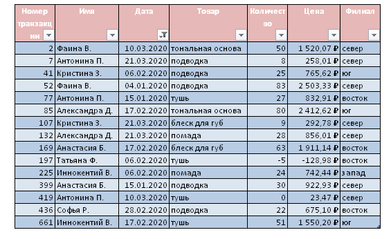
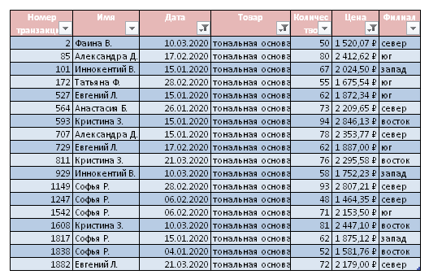
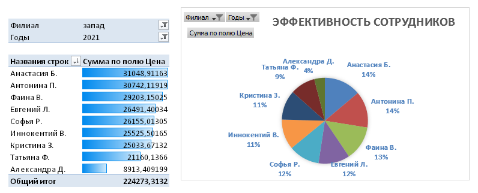
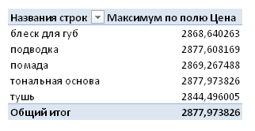

# Основы анализа данных в Excel (семинары)

## Практическое задание. Урок 4. Анализ данных: часть 1

*Условие задания:*
В таблице файла Семинар4_задача3 выполните следующие задания:

1. Найдите все уникальные комбинации “имя-продукт-регион”, встречающиеся в сделках за первые три месяца 2020г.

2. Найдите все сделки с тональной основой за первые три месяца 2020г., в которых цена за единицу продукции была выше средней цены за тональную основу за весь период.

3. Постройте отчет по продажам продукции за 2021 год в западном филиале. Выделите каким либо образом сотрудника, который заключил сделки с наибольшей суммарной выручкой. Постройте диаграмму, отражающую эффективность сотрудников в 2021 году в данном филиале

4. Найдите самую крупную сделку (с точки зрения выручки) для каждого продукта.

